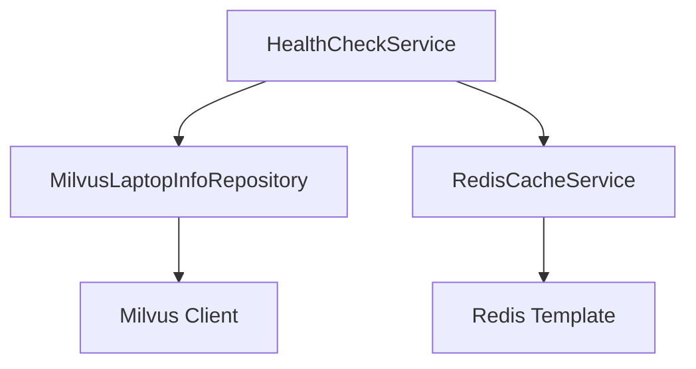

# 搜索服务API文档

## 存储层架构更新



## 健康检查API

### GET /api/health

检查系统健康状况，包括：
- Milvus向量数据库连接状态
- Redis缓存服务连接状态

响应示例：
```json
{
    "status": "UP",
    "components": {
        "milvus": {
            "status": "UP"
        },
        "redis": {
            "status": "UP"
        }
    }
}
```

## 存储层服务接口

### RedisCacheService
- `isConnected()`: 检查Redis连接状态

### MilvusLaptopInfoRepository
- `isConnected()`: 检查Milvus连接状态
- 其他CRUD方法保持不变
